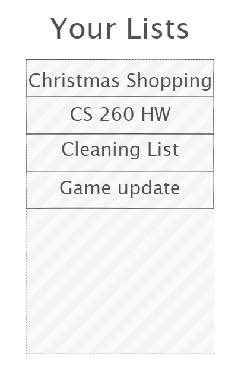
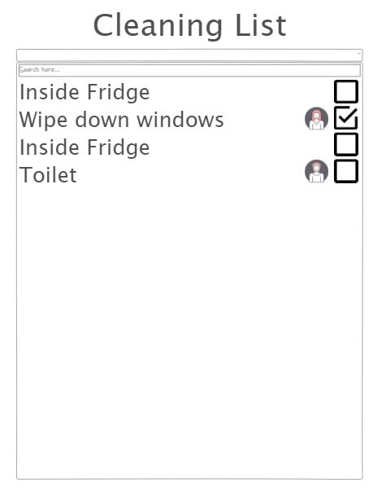

# TODO List
[Notes for midterm and final](notes.md)

## Specification Deliverable

### Elevator Pitch
Why is it that collaborative task management always has to be so complicated? Have you ever wanted a simple list of tasks that you can share with anyone you want? The TODO List software will allow you to create and manage the members of a list. Individuals can pick tasks to assign themselves to and mark them done when they have finished. This site makes it easy to organize the completion of a seemingly random set of tasks.

### Design
This is the screen which lists which todo lists you have.

This screen is where you can assign yourself to tasks, add more, or check them off.

### Key Features
- Accounts with secure login and encrypted passwords
- Ability to create todo lists
- Invite other users to your todo lists
- Assign yourself to items in the lists
- Mark items as completed
- Changes to the list are displayed live to other users

### Technologies
The required technologies will be used as such:
- **HTML** - Structure of the web pages. There will be various pages used for login, list overview, todo list, etc.
- **CSS** - Style the UI in a way that is visually appealing and efficient with screen real-estate.
- **JavaScript** - Control login page and live UI changes to TODO lists.
- **Web Services** - Endpoints for
	- Creating lists
	- Registering
	- Retrieving available lists
	- Retrieving list data
- **Persistence/Accounts** - Use a database to store account information and allow logins.
- **WebSocket** - Communicate with the clients when you or other users make changes to or invite others to todo lists.

# CSS Deliverable
- Prerequisite: Simon CSS deployed to your production environment
	- Done
- Prerequisite: A link to your GitHub startup repository prominently displayed on your application's home page
	- Bottom right corner GitHub icon
- Prerequisite: Notes in your startup Git repository README.md file documenting what you modified and added with this deliverable. The TAs will only grade things that have been clearly described as being completed. Review the voter app as an example.
	- Information here
- Prerequisite: At least 10 git commits spread consistently throughout the assignment period.
	- Done
- Properly styled CSS
	- Header, footer, and main content body
		- Header and footer styled and stored in separate files to avoid repeating
		- Each page uses a flex display for the body which includes these three elements
	- Navigation elements
		- Nav links at top
	- Responsive to window resizing
		- Element sizes mostly based on viewport size
	- Application elements
		- There are styled tables for the list of lists and the TODO lists themselves
	- Application text content
		- Done
	- Application images
		- There is an image in the about page that scales with viewport
		- The GitHub logo and checkbox images are SVGs which are styled to adjust with the current theme pallette

# JavaScript Deliverable
- Represent required technologies
	- *HTML* and *CSS* are used by *JavaScript* to dynamically change the appearance of the page.
	- *JavaScript* is used for all the interaction with the lists: adding lists, adding elements to lists, changing the done status of items, changing the assignee of an item, etc.
	- *Authentication*: The main page allows you to login using a username and password which are then displayed in the header on the top right of the page. Passwords are not yet used due to lack of encryption for storage into a database. The username to assign a creator when creating a list.
	- *Database data*: Right now the site uses a mock database in the form of localStorage. It stores the username, lists, and list items. Lists contain a name, creator, and items. List items contain a task, assignee, and is done status.
	- *WebSocket data*: The lists themselves are going to change as other using make changes to shared lists. A mock representation of this is given where the checkboxes change as if from a WebSocket message.
	- *Colormind*: The site is going to use the external service from colormind to randomly select a color palette to apply to the site. For now you can only manually set the values of the color palette.